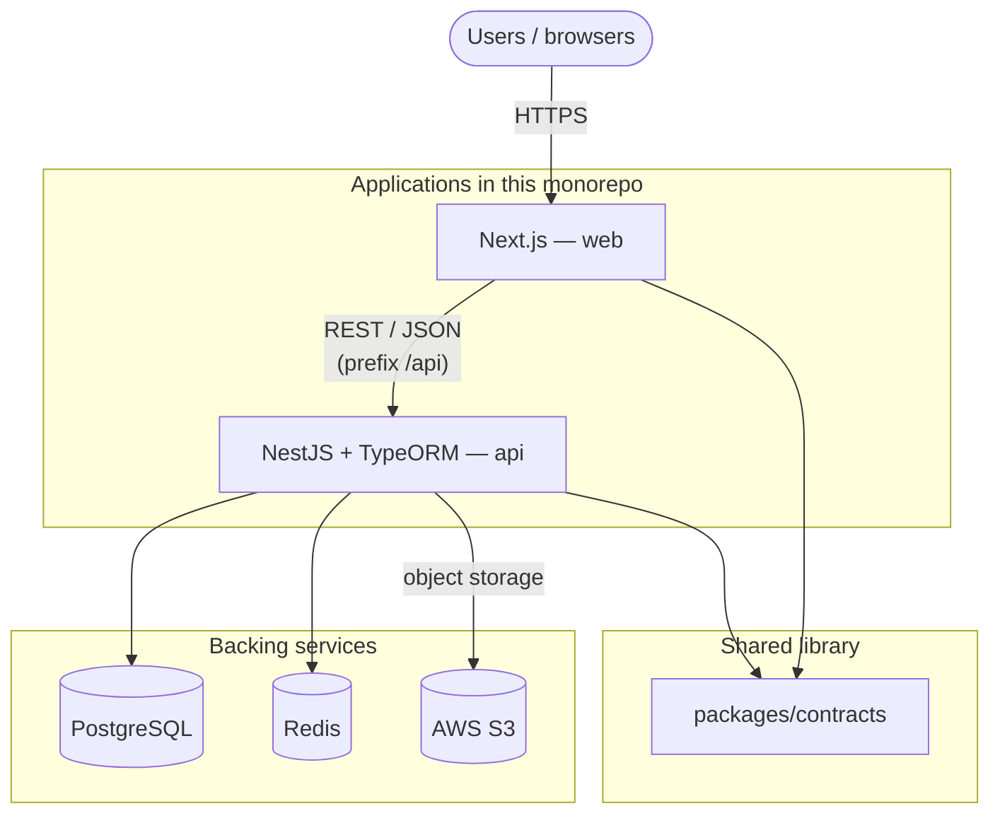
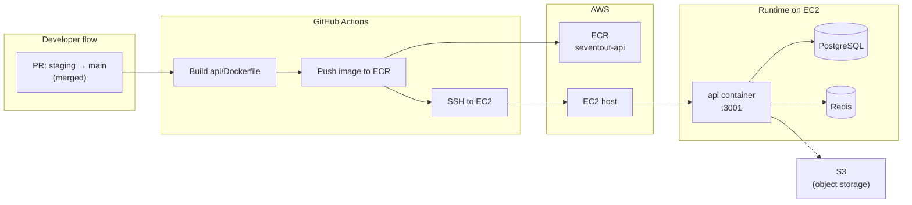

# Seventout.stu-Website Monorepo

Monorepo for Seventout student website platform.

## Tech stack

- Frontend: Next.js (`web`)
- Backend: NestJS + TypeORM (`api`)
- Database: PostgreSQL
- Cache: Redis
- Queue: BullMQ (phase 1), SQS-ready abstraction (phase 2)
- Storage: AWS S3
- Infra target: AWS
- DevOps: Docker + GitHub Actions

## Project structure

- `web`: Next.js frontend app
- `api`: NestJS backend app
- `packages/contracts`: shared contracts (queue names, shared types)

## System architecture

Runtime view of how clients, apps in this repo, and backing services fit together. Production hosting for the API follows [Deployment architecture](#deployment-architecture); the web app is commonly deployed separately (see [DevOps docs](#devops-docs)).

Redis backs **caching** and **BullMQ** job queues in phase 1; the same `QueuePort` abstraction is intended to support **SQS** later without changing domain code (see [Queue strategy](#queue-strategy)).

## Prerequisites

- Node.js 22+
- Corepack enabled
- Docker Desktop

## Local setup

1. Copy env templates:
   - `cp .env.example .env` (or create manually on Windows)
   - `cp api/.env.example api/.env`
   - `cp web/.env.example web/.env.local`
2. Start infra services:
   - `docker compose up -d`
3. Install dependencies:
   - `corepack pnpm install`

## Run apps

- Start all apps in monorepo:
  - `corepack pnpm dev`
- Frontend only:
  - `corepack pnpm --filter @apps/web dev`
- Backend only:
  - `corepack pnpm --filter @apps/api dev`

Default ports:
- Web: `3000`
- API: `3001` with global prefix `/api`
- Postgres (Docker): `5433` mapped to container `5432`
- Redis (Docker): `6379`

## Database migration

- Run migrations:
  - `corepack pnpm --filter @apps/api migration:run`

## Scripts

- `corepack pnpm lint`
- `corepack pnpm test`
- `corepack pnpm build`

## Commit message convention

- Required format: `<type>(scope): <message>`
- Example: `feat(api): add queue abstraction for jobs`
- Supported types: `feat`, `fix`, `docs`, `style`, `refactor`, `perf`, `test`, `build`, `ci`, `chore`, `revert`
- Commit hook is enforced via Husky + Commitlint

## Branch policy via CI

- `main`:
  - PR source must be `staging`
  - CI must pass
  - At least 1 approval review
- `staging`:
  - PR source must be `dev`
  - Integration test job runs in CI
- `dev`:
  - PR source must be `feature/*`

## Queue strategy

- Phase 1: use BullMQ adapter (`QueuePort` -> BullMQ)
- Phase 2: add SQS adapter implementing same `QueuePort`
- Domain services should depend on `QueuePort`, not queue vendor SDK

## Case study (design rationale)

Short answers to common “why did we build it this way?” questions. Implementation lives mainly under `api/src/modules/auth`, `api/src/modules/authorization`, and `api/src/infra/database/migrations`.

### Why a monorepo?

- **One source of truth for contracts** — `packages/contracts` is shared by `web` and `api` without publishing npm packages or duplicating types.
- **Atomic changes** — API and UI can move together in a single PR when a feature touches both sides.
- **Single CI pipeline** — install, lint, test, and build the whole product once (`pnpm` workspaces); staging PRs also run integration tests against Postgres + Redis.

### Why Amazon ECR?

- **Private, first-party registry in AWS** — images are not public; access aligns with the same account/region as EC2 (`ap-southeast-1` in the deploy workflow).
- **Immutable deploy tags** — each release is addressed by image digest/tag (short SHA), so rollbacks mean “re-point to a known image,” not rebuilding on the server from scratch.
- **Simple EC2 flow** — the host runs `docker login` to ECR and pulls; no separate artifact server to operate.

### Deployment strategy

- **Branch flow** — `feature/*` → `dev` → `staging` → `main`; merges into `main` from `staging` are the only path that triggers production API deploy (enforced in CI policy + `deploy-main.yml`).
- **API** — build once in GitHub Actions, push to ECR, SSH to EC2, `docker compose -f docker-compose.ec2.yml up` for the `api` service only, then run migrations inside the new container (see [Deployment architecture](#deployment-architecture)).
- **Web** — typically hosted separately (e.g. Vercel) with `NEXT_PUBLIC_API_URL` pointing at the API; see `docs/devOps/vercel-vps-s3.md`.

### Migration strategy

- **TypeORM migrations** — versioned files under `api/src/infra/database/migrations`; CLI is wired via `typeorm.config` (`migration:run` for dev, `migration:run:prod` against compiled `dist` in production).
- **Apply after the new API image is live** — the deploy workflow runs `migration:run:prod` inside the `seventout_api` container so schema changes ship with the code that expects them; generate new migrations locally with `migration:generate` when the schema changes.

### Auth design

- **JWT access tokens** — Bearer token in `Authorization`; validated with `JWT_ACCESS_SECRET` via Passport (`JwtStrategy`).
- **Refresh tokens** — separate JWT signed with `JWT_REFRESH_SECRET`; server stores only a **bcrypt hash** of the refresh token in the database (revocable, rotatable); access payload includes `sub`, `email`, `role`, and `permissions`.
- **Google sign-in** — optional OAuth2 path (`GoogleStrategy` / `GoogleAuthGuard`) alongside email-password flows where applicable.
- **Hardening** — Helmet, CORS allowlist in production (`CORS_ALLOWED_ORIGINS`), optional `trust proxy` behind a reverse proxy.

### RBAC design

- **Roles** — `ADMIN`, `STAFF`, and `USER` (`UserRole` in `api/src/modules/authorization/authorization.types.ts`).
- **`AuthorizationGuard`** — runs after authentication: **`ADMIN`** is allowed for any route metadata; **`STAFF`** must satisfy `@RequireRoles(...)` and, when set, **`@RequirePermissions(...)`** against codes in `PermissionCode` (fine-grained catalog, orders, payments, CMS, audit, etc.); **`USER`** routes can require **`@RequireOwnerParam('id')`** so the URL param must match the authenticated user’s id (self-service only).
- **Token payload** — access JWT carries `role` and a list of permission **codes** so the guard can decide without an extra DB round-trip on every request (permissions are loaded when tokens are issued).

## Observability

What exists in-repo today; there is **no** bundled APM, metrics server, or distributed tracing (OpenTelemetry, Datadog, Sentry, etc.). Wire those at the process or edge (reverse proxy, load balancer, container runtime) when you need dashboards and alerting.

- **Application logs** — Nest `Logger` is used for operational signals (for example `HttpExceptionFilter` logs **unhandled** exceptions with stack traces; `AuthorizationGuard` logs **403** denials with method, path, user id, role, and reason code).
- **Consistent HTTP errors** — `HttpExceptionFilter` maps exceptions to a JSON envelope (`success`, `error.code`, `message`, optional `details`) so clients and log parsers get stable shapes.
- **Audit trail** — Domain actions enqueue rows through `AuditWriterService` → BullMQ → `AuditLogProcessor` → PostgreSQL (`audit_logs`), with `AuditHttpContextMiddleware` attaching **IP, user agent, method, and path** when present. Staff/admin can query logs via `GET /admin/audit-logs` when granted `AUDIT_READ` (see `api/src/modules/audit`).
- **API exploration** — OpenAPI/Swagger is served at `/docs` when enabled (`SWAGGER_ENABLED` or non-`production` `NODE_ENV` by default); turn it off in production unless you intentionally expose it.
- **CI signal** — `pnpm test:cov` in `.github/workflows/ci.yml` keeps unit coverage visible on every PR/push.

## Security

Defense-in-depth highlights from the Nest API (`api/src`); pair with TLS at the reverse proxy, patched OS images, and least-privilege IAM for AWS (S3/ECR) as described in `docs/devOps/vercel-vps-s3.md`.

- **HTTP surface** — **Helmet** for baseline secure headers; **global `ThrottlerGuard`** (`THROTTLE_TTL_MS` / `THROTTLE_LIMIT`) with **tighter limits on auth routes** (`THROTTLE_AUTH_TTL_MS` / `THROTTLE_AUTH_LIMIT` on `auth.controller` login/register/refresh, etc.).
- **Input handling** — **Global `ValidationPipe`** with `whitelist`, `forbidNonWhitelisted`, and `transform` to reject unknown fields and coerce DTOs.
- **CORS** — Production **rejects `*` origins** at config validation time; use an explicit comma-separated allowlist (`CORS_ALLOWED_ORIGINS`). `credentials: true` is enabled for cookie-capable flows when you align origins.
- **Secrets & bootstrap** — `validateEnv` enforces strong non-default **JWT**, **DB**, and **default admin** passwords in **production** and blocks known weak placeholder values.
- **Authentication** — Short-lived **access JWT**; **refresh** tokens stored as **bcrypt hashes** in the database so leaks from backups/logs are not usable as-is; optional **Google OAuth** via Passport.
- **Authorization** — JWT + `AuthorizationGuard` / role / permission / owner checks (see [RBAC design](#rbac-design) in the case study above).
- **Operational hygiene** — `TRUST_PROXY` when behind a reverse proxy so rate limits and audit client IP reflect the real client; disable or lock down **Swagger** in production.

## Deployment architecture

Production API delivery is automated from GitHub when a pull request **from `staging` into `main`** is merged. The workflow builds the NestJS image, pushes it to **Amazon ECR** (`ap-southeast-1`), then connects over **SSH** to **EC2**, pulls the new tag, recreates the `api` service with **Docker Compose**, and runs database migrations inside the container.

| Piece | Role |
| --- | --- |
| `.github/workflows/deploy-main.yml` | Merge gate + build/push/deploy pipeline |
| `api/Dockerfile` | Production API image |
| `docker-compose.ec2.yml` | Stack expected on the server (`api` from ECR + Postgres + Redis) |
| `docker-compose.vps.yml` | Optional compose for a generic VPS build-from-repo setup |
| `docs/devOps/vercel-vps-s3.md` | End-to-end guide for **Vercel (web) + VPS/EC2 (api) + S3** |

**Server expectations on EC2:** a deploy directory (default `~/seventout-deploy`) containing `.env` (with DB/Redis/AWS and `IMAGE_TAG` / `ACCOUNT_ID` / `AWS_REGION` updated by the workflow), `docker-compose.ec2.yml`, and **AWS CLI** for `docker login` to ECR. Secrets for Actions: AWS credentials, account id, ECR repo name, EC2 host/user/SSH key (see workflow file for exact names).

**CI (all branches / PRs):** `.github/workflows/ci.yml` runs install, lint, tests with coverage, and monorepo build—deploy only runs on the merged `staging` → `main` path above.

## DevOps docs

- `docs/devOps/vercel-vps-s3.md`: deployment guide for `Vercel + 1 VPS + S3`
